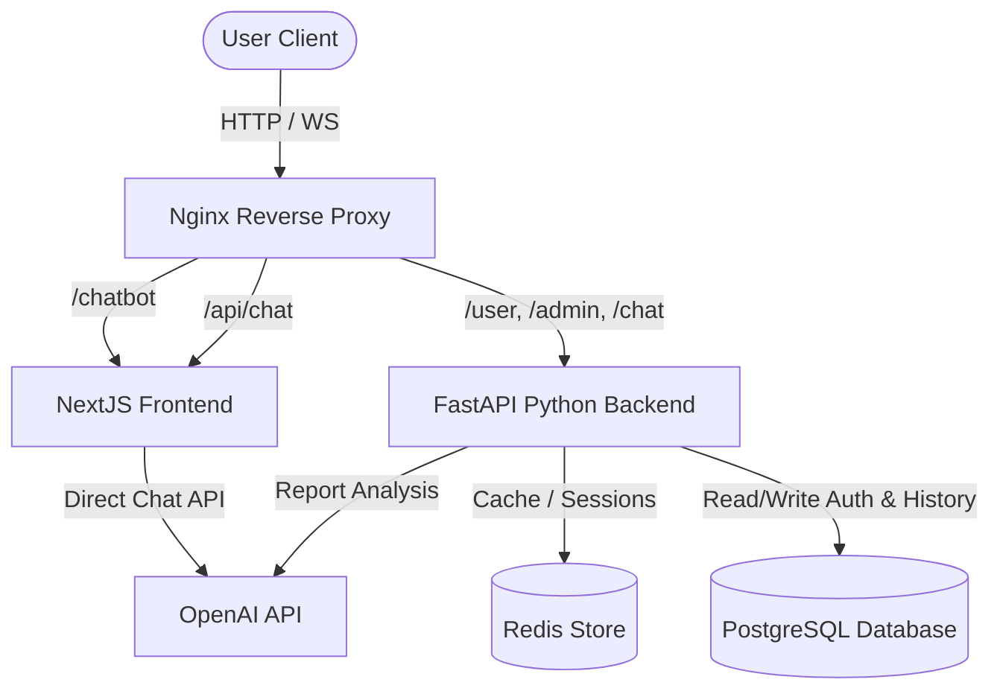

# Scanno AI Chatbot Platform

An enterprise-ready, containerized, AI-powered vehicle inspection chatbot platform for **Scanno Car Inspection Center** (Doha, Qatar). This system analyzes vehicle specifications, maintenance records, and processes uploaded reports (PDFs, JPEGs, PNGs) using advanced OpenAI GPT-4o vision and text models.

---

## 📂 Project Architecture & Codebase

This repository contains two main services:
- **`frontend/`**: Next.js 16 application styled using Tailwind CSS v4 and DaisyUI v5. Integrates directly with OpenAI client-side for conversational assistant features.
- **`backend+ai/Scanno_auth`**: FastAPI service that manages authentication (Engineers & Admins), securely manages OpenAI API keys in PostgreSQL, and processes unified file report requests.

### System Architecture Diagram


---

## 📖 Clickable System Documentation (Artifacts)

The following comprehensive guides and audits are available for developers and DevOps engineers:
* **[Project Audit & Security Report](file:///C:/Users/Night%20Shift/.gemini/antigravity-ide/brain/647abe58-61c9-452d-9fc6-15e8066cb838/audit_report.md)**: Production codebase audit, identified vulnerabilities, and performance analyses.
* **[Architecture & Database Documentation](file:///C:/Users/Night%20Shift/.gemini/antigravity-ide/brain/647abe58-61c9-452d-9fc6-15e8066cb838/architecture_docs.md)**: Deep dive into the architecture components, database tables, relations, and AI workflows.
* **[API & Environment Reference](file:///C:/Users/Night%20Shift/.gemini/antigravity-ide/brain/647abe58-61c9-452d-9fc6-15e8066cb838/api_docs.md)**: Detailed mapping of HTTP routes, parameters, payloads, and environmental variables.
* **[Deployment & Setup Guide](file:///C:/Users/Night%20Shift/.gemini/antigravity-ide/brain/647abe58-61c9-452d-9fc6-15e8066cb838/deployment_guide.md)**: Instructions on local development setup, docker compose building, Ubuntu VPS scaling, and database backups.

---

## ⚡ Quick Start with Docker

The fastest way to spin up the entire containerized suite (Nginx + Next.js + FastAPI + Postgres + Redis) is via Docker Compose:

1. **Clone the repository and enter the root**:
   ```bash
   cd scanno-ai-chatbot
   ```

2. **Configure environment variables**:
   Create a `.env` file in the root based on [.env.example](file:///d:/FAI_Projects/project_9_scanno_ai_chatbot/.env.example):
   ```bash
   cp .env.example .env
   # Edit variables in .env (add your OPENAI_API_KEY)
   ```

3. **Start services**:
   ```bash
   docker compose up --build -d
   ```

4. **Verify operations**:
   Open [http://localhost](http://localhost) in your browser to verify the landing page and chatbot interface.
   Check system readiness:
   ```bash
   curl http://localhost/ready
   ```

---

## 🛠️ Main Tech Stack
- **Frontend**: Next.js 16 (React 19), Tailwind CSS v4, DaisyUI v5.
- **Backend**: FastAPI (Python 3.11), SQLAlchemy ORM.
- **Data Stores**: PostgreSQL 15, Redis 7 (TTL Session caching).
- **Gateway**: Nginx Reverse Proxy.
